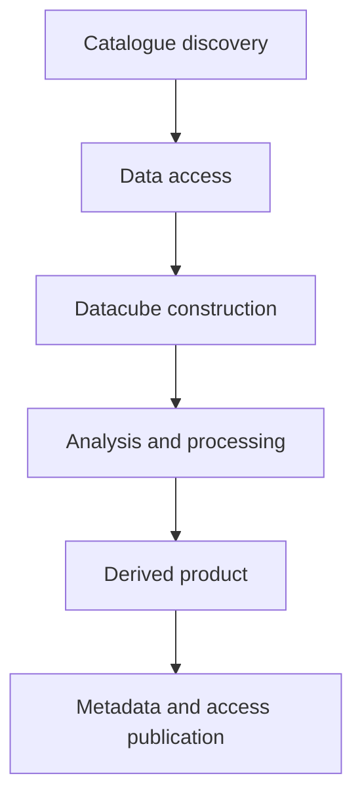
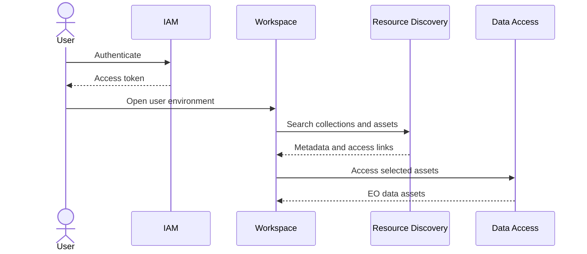
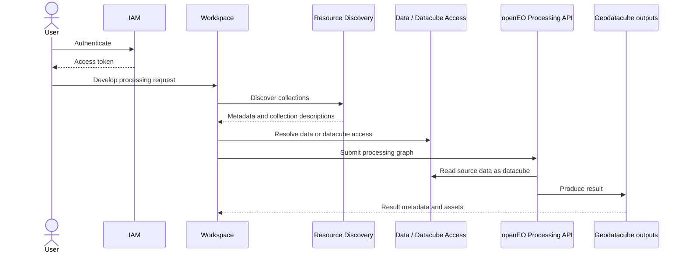
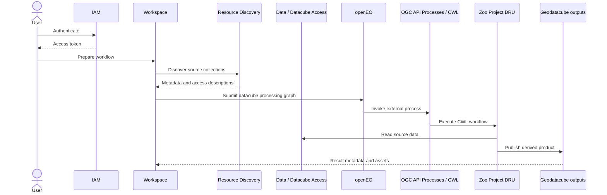

# Geodatacube Management Best Practice Outline

## Table of contents

| Section | Title |
|---:|---|
| 1 | [Abstract](#abstract) |
| 2 | [Keywords](#keywords) |
| 3 | [Preface](#preface) |
| 4 | [Security considerations](#security-considerations) |
| 5 | [Submitters](#submitters) |
| 6 | [Scope](#scope) |
| 7 | [Conformance](#conformance) |
| 8 | [Normative references](#normative-references) |
| 9 | [Terms and definitions](#terms-and-definitions) |
| 10 | [Conventions](#conventions) |
| 11 | [Identifiers](#identifiers) |
| 12 | [Abbreviated terms](#abbreviated-terms) |
| 13 | [Components overview](#components-overview) |
| 14 | [GeoDataCube Management System](#geodatacube-management-system) |
| 15 | [Interoperable building blocks](#interoperable-building-blocks) |
| 16 | [Geodatacube Best Practice](#geodatacube-best-practice) |
| 17 | [Scenario 1: Simple Data Access](#scenario-1-simple-data-access) |
| 18 | [Scenario 2: Processing via openEO](#scenario-2-processing-via-openeo) |
| 19 | [Scenario 3: Processing via openEO using OGC API Processes / CWL](#scenario-3-processing-via-openeo-using-ogc-api-processes--cwl) |
| 20 | [Annexes](#annexes) |

## Abstract

The rapidly growing volume of Earth observation data, together with the increasing diversity of data providers, platforms, formats, APIs, and processing environments, makes it difficult for users to consistently discover, access, prepare, and use data for analysis. While metadata standards and catalogues provide an essential foundation for discovery and description, additional guidance is needed on how discovered datasets can be transformed into analysis-ready geodatacubes and managed throughout their use.

This Best Practice provides recommendations for geodatacube management, focusing on the pathways from metadata and data discovery towards usable multidimensional datacubes. It describes how metadata-driven approaches can support the creation, configuration, access, and processing of geodatacubes across heterogeneous infrastructures. Building on previous work, including OGC Testbed 19, the document explores the role of openEO and relevant open-source EOEPCA building blocks as interoperable components for exposing, processing, and managing Earth observation data as geodatacubes.

The goal of this Best Practice is to provide practical guidance for data providers, platform operators, and application developers who need to design geodatacube management systems. It recommends approaches for bridging discovery metadata, data access mechanisms, processing interfaces, and datacube representations in a way that improves interoperability, reproducibility, and usability of Earth observation data.

## Keywords

GeoDataCube, GDC, OGC, best practice

## Preface

_TBD_

## Security considerations

_TBD_

Potential topics:

- Authentication and authorization for catalogue, data access, processing, and workspace services.
- Access control propagation from discovery metadata to processing workflows.
- Secure handling of user workspaces, credentials, and derived data products.
- Auditability and traceability of processing requests and generated datacubes.

## Submitters

_TBD_

## Scope

This document specifies a set of best practice recommendations for the management of geospatial data as geodatacubes. The scope of this document is the transition from metadata-driven discovery of Earth observation datasets to their access, organization, processing, and use as multidimensional geodatacubes.

The document provides guidance on the use of metadata records, catalogues, data access information, and processing interfaces to support interoperable geodatacube management. It includes consideration of openEO as an interface for geodatacube access and processing, and considers the use of open-source EOEPCA building blocks as components within geodatacube management architectures.

This document is intended to support implementers of data platforms, processing services, and client applications that need to manage Earth observation data in a datacube-oriented form. It does not define a new standard for geodatacube encoding, metadata, or processing. Instead, it identifies recommended practices for combining existing standards, interfaces, and software components to support consistent and reusable geodatacube workflows.

### In scope

- Transition from metadata discovery to usable geodatacubes.
- Management of Earth observation datasets as multidimensional datacubes.
- Role of catalogue metadata, data access descriptions, and processing interfaces.
- Recommended use of openEO for datacube access and processing.
- Possible role of EOEPCA open-source building blocks.

### Out of scope

- Defining a new metadata standard.
- Defining a new file format.
- Defining a new datacube API.

## Conformance

_TBD_

Potential approach:

- Define conformance classes for recommended implementation patterns.
- Separate provider-side, platform-side, and client-side recommendations.
- Distinguish mandatory requirements from optional recommendations once the Best Practice is formalized.

## Normative references

References to standards and specifications that the Best Practice relies on.

_TBD_

Potential references:

- OGC API standards relevant to discovery, access, and processing.
- STAC specification.
- openEO API specification.
- Common Workflow Language (CWL).
- Cloud Optimized GeoTIFF (COG).
- Zarr.

## Terms and definitions

| Term | Definition |
|---|---|
| geodatacube | _TBD_ |
| datacube | _TBD_ |
| Earth observation collection | _TBD_ |
| metadata record | _TBD_ |
| catalogue | _TBD_ |
| analysis-ready data | _TBD_ |
| spatiotemporal asset | _TBD_ |
| dimension | _TBD_ |
| measure | _TBD_ |
| coordinate reference system | _TBD_ |
| chunking | _TBD_ |
| tiling | _TBD_ |
| processing graph | _TBD_ |
| virtual datacube | _TBD_ |
| materialized datacube | _TBD_ |
| data access service | _TBD_ |
| processing service | _TBD_ |

## Conventions

_TBD_

## Identifiers

_TBD_

## Abbreviated terms

| Abbreviation | Term |
|---|---|
| API | Application Programming Interface |
| COG | Cloud Optimized GeoTIFF |
| CWL | Common Workflow Language |
| DGGS | Discrete Global Grid System |
| EO | Earth Observation |
| EP | Exploitation Platform |
| GDC | GeoDataCube |
| GDAL | Geospatial Data Abstraction Library |
| IAM | Identity and Access Management |
| JSON | JavaScript Object Notation |
| OGC | Open Geospatial Consortium |
| OS | Operating System |
| REST | Representational State Transfer |
| SAFE | Standard Archive Format for Europe |
| SNAP | Sentinel Application Platform toolbox |
| STAC | SpatioTemporal Asset Catalog |
| TBD | To Be Determined |
| TIFF | Tagged Image File Format |
| URL | Uniform Resource Locator |
| YAML | YAML Ain’t Markup Language |

## Components overview

A geodatacube management system can be described as a composition of interoperable building blocks. The system connects discovery metadata, data access services, datacube access, processing interfaces, and user workspaces without requiring a new GDC-specific API.

## GeoDataCube Management System

Earth observation data is increasingly discoverable through catalogues and metadata services, but discovery alone does not make data directly usable as geodatacubes. A user may be able to find a relevant dataset or collection, but still need to determine which assets are available, how those assets can be accessed, how they are organized in storage, which dimensions and measurements they contain, and which processing interfaces can consume them.

In many existing systems, metadata records, asset links, storage layouts, access APIs, datacube abstractions, and processing APIs are managed separately. This creates interoperability gaps between the point where a user discovers data and the point where the same data can be analyzed as a consistent multidimensional geodatacube. Clients and workflows often need provider-specific knowledge to resolve asset locations, interpret grid definitions, handle authentication, or construct processing requests.

A geodatacube management system addresses this gap by providing a repeatable path from discovery to use. The system should help users and applications move from catalogue discovery, to data access, to datacube construction, to analysis and processing, and finally to the creation or publication of derived products. The purpose of this Best Practice is not to define a new geodatacube API, but to describe how existing metadata, access, processing, workspace, and storage components can be combined consistently.

### Conceptual model

The conceptual model identifies the main information objects and services involved in geodatacube management. These concepts are used throughout the Best Practice to describe how discovery metadata, data assets, processing workflows, and user environments relate to one another.

| Concept | Description |
|---|---|
| Dataset / collection | A logical grouping of Earth observation data with common characteristics, such as sensor, processing level, spatial coverage, temporal coverage, or product type. A collection is usually the object discovered first through a catalogue. |
| Asset | A concrete data resource associated with a dataset, collection, or item. Assets may include raster files, multidimensional arrays, metadata files, quality masks, thumbnails, or other supporting resources. |
| Metadata record | A machine-readable description of a dataset, collection, item, asset, service, or derived product. Metadata records provide discovery information and should include enough detail to support access and datacube construction. |
| Geodatacube | A multidimensional organization of geospatial data, typically using spatial, temporal, spectral, or other domain-specific dimensions. A geodatacube provides a structured view of EO data for access, analysis, and processing. |
| Virtual geodatacube | A logical datacube view over one or more existing assets without necessarily creating a new physical copy of the data. A virtual geodatacube is constructed from metadata, access information, and interpretation rules. |
| Materialized geodatacube | A physical datacube product that has been generated and stored in a concrete format, such as Zarr, NetCDF, COG collections, or another cloud-optimized representation. Materialized geodatacubes are useful when repeated access or processing justifies precomputed storage. |
| Datacube view | A user- or application-specific subset, projection, aggregation, or interpretation of a geodatacube. A view may constrain dimensions, bands, spatial extent, temporal extent, resolution, CRS, or processing level. |
| Processing graph | A machine-readable description of analysis or transformation steps applied to input data. Processing graphs are used by systems such as openEO to describe reproducible datacube workflows. |
| Derived product | A new data product produced by processing source data or an existing geodatacube. Derived products should include metadata, provenance, access information, and, where appropriate, links back to the source datasets and processing workflow. |
| Workspace | A user or project environment where data can be discovered, accessed, processed, stored, and shared. Workspaces may include notebooks, development environments, temporary storage, workflow execution tools, and collaboration features. |
| Access policy | The rules that determine who may discover, access, process, modify, publish, or share datasets, assets, workspaces, processing jobs, and derived products. Access policies should be applied consistently across catalogue, data access, processing, and workspace services. |

### Management concerns

A geodatacube management system should describe and coordinate the following concerns:

- The relationship between metadata discovery and datacube construction.
- The distinction between virtual and materialized geodatacubes.
- Data access patterns for cloud-native EO assets.
- The role of chunking, tiling, and storage layout.
- The integration of processing graphs and workflow execution.
- Publication of derived products with metadata, access links, and provenance.
- Interoperability between platforms and user-facing clients.

## Interoperable building blocks

The Best Practice should describe how existing building blocks can be assembled into reusable geodatacube workflows.

| Layer | Candidate building blocks / standards | Purpose |
|---|---|---|
| Identity and access | IAM | Authenticate users and control access to services and assets. |
| Discovery | Resource Discovery, OGC CSW, OGC API Records, STAC, OpenSearch | Find collections, assets, metadata records, and service links. |
| Data access | Data Access, OGC APIs, cloud-native asset links | Retrieve source data or expose asset-level access. |
| Datacube access | Datacube Access, openEO, relevant multidimensional APIs | Expose EO data in datacube-oriented form. |
| Processing | openEO Processing API, OGC API Processes, CWL | Execute processing graphs and workflows. |
| Workspace | Workspace | Provide user environments for development, execution, and collaboration. |
| Storage | Object storage, Zarr, COG, other cloud-optimized formats | Store source assets and derived products efficiently. |

## Geodatacube Best Practice

The scenarios are loosely based on the GDC SWG Testbed 19 conceptual ideas of different levels of use case scenarios.

### Scenario summary

| Scenario | Main purpose | Typical flow |
|---|---|---|
| [Scenario 1](#scenario-1-simple-data-access) | Simple data discovery and access. | IAM → Workspace → Resource Discovery |
| [Scenario 2](#scenario-2-processing-via-openeo) | Datacube processing through openEO. | IAM → Workspace → Resource Discovery → Data Access / Datacube Access → openEO |
| [Scenario 3](#scenario-3-processing-via-openeo-using-ogc-api-processes--cwl) | openEO-based processing that invokes OGC API Processes / CWL workflows. | IAM → Workspace → Resource Discovery → Data Access / Datacube Access → OGC API Processes / CWL |

## Scenario 1: Simple Data Access

Simple discovery and access to EO data assets through workspace and catalogue services.

## Scenario 2: Processing via openEO

Discovery, datacube access, and processing through openEO.

## Scenario 3: Processing via openEO using OGC API Processes / CWL

Discovery and datacube-oriented processing where openEO workflows are combined with OGC API Processes and CWL-based execution, for example through the Zoo Project DRU.

## Annexes

_TBD_

Potential annexes:

- Mapping between EOEPCA building blocks and GDC SWG objectives.
- Example metadata-to-datacube workflow.
- Example openEO processing graph.
- Example CWL integration pattern.
- Comparison of virtual and materialized datacube approaches.
